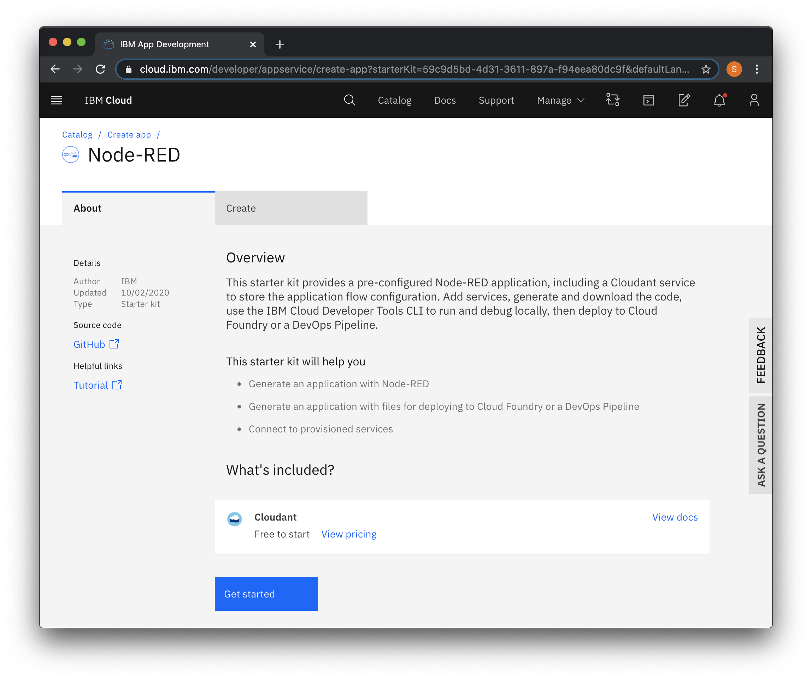
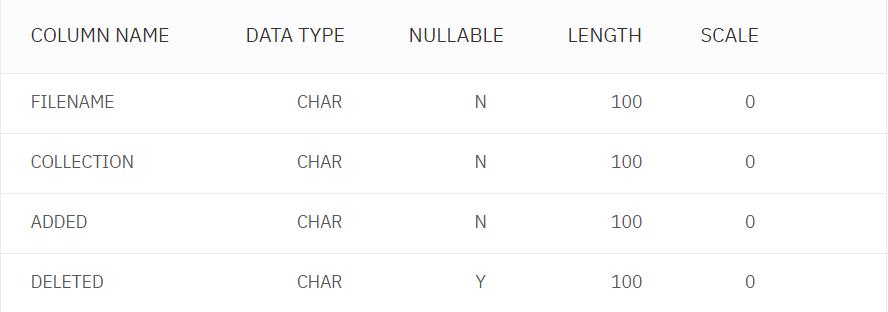
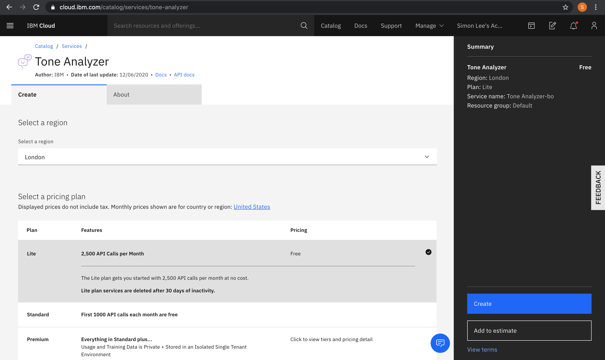

# Financial-Document-Analyser
This repository contains the JSON file of the Node-Red flow, as well as installation instructions below.

# Source Code Description
The JSON file comprises of different flows contained in different tabs, which are all easily imported in one go. 
The tabs are as follows:
- Main App - Contains flow for document consumption feature
- Search Query - Contains flow to allow users to utilise the search extension functionality
- Delete Collection Daily - Contains flow to delete collections at regular basis to comply with GDPR concerns
- Webscrape combine - Contains flow that helps scrape data from CompaniesHouse
- Debug tools - Contains simple web pages to help obtain the requisite information.

To import the code into your own NodeRed workspace, copy the JSON file’s contents into yourclipboard, navigate to the NodeRed menu, select import, and paste the contents into the textbox provided. More instructions on setting up the workspace can be found below.

# Installation Instructions

Firstly, navigate to [IBM Cloud](https://cloud.ibm.com/) and login to access the dashboard. This may require you to create an IBM cloud account. Once logged into IBM Cloud, navigate to the [catalog](https://cloud.ibm.com/catalog). Search for Node-RED app, and create an instance of the service, as shown below.

**Figure 1** - Node-Red Setup

This process should also help create an instance of Cloudant, as detailed in this [tutorial](https://developer.ibm.com/components/node-red/tutorials/how-to-create-a-node-red-starter-application/). This link also provides more details on setting choices when creating the instance. Having created this instance, navigate to the Node-RED Cloud Application under Apps in your resource list. Click on App URL, and at that web page, click on "Go to your flow editor". At the top right hand corner, there should be a dropdown menu, where you can import the flows via the JSON file as mentioned above.

Upon importing the flows, navigate back to the same catalog, and create an instance of Discovery. Using the resource list on the dashboard, click on the Discovery instance under "services". Here, you can find the API key and URL details of the Discovery instance. Navigate back to the Node Red flow editor, and change the parameters of the nodes to this API Key and URL where relevant. The areas within the flows where the placeholder values need to be replaced are annotated throughout the flows. Next, using the /makeenv URL, create a new Environment within Discovery and use the /listenv URL to get the environment id. Save this environment id for future usage, and change the values of the environment id within the nodes.

Return to the catalog once more, and search for Db2. Create an instance of Db2, and navigate to it from the resource list. Create a new set of credentials for that instance, and locate the credentials under "Service Credentials". Trawl through the credentials to find the username. Launch the console of Db2, and locate the schema with the same name as the username in the credentials. Click on the schema, and create a new table as shown below. 

**Figure 2** - Db2 Table

This table should have the name "FILELOG", with four columns "FILENAME", "COLLECTION", "ADDED", and "DELETED". All 4 columns should have a type "CHAR", length 100, scale 0, and only the "DELETED" Column being "Y" on Nullable. Using your instance of Db2 and the credentials, change the appropriate values in the dashDb nodes in the delete collection tab. To kickstart the logging process, click the inject node in the same tab, and change the setting to repeat at the regular interval you wish for.

In order to support full functionality of personality insights, users need to install [Tone Analyzer](https://cloud.ibm.com/catalog/services/tone-analyzer), as shown in Figure 3 below. The configurations generally resemble the previous settings of Discovery or Node-RED, and after the successful installation, the API key and service URL should be used for Tone Analyzer's working on the entire application.

**Figure 3** - Tone Analyzer
